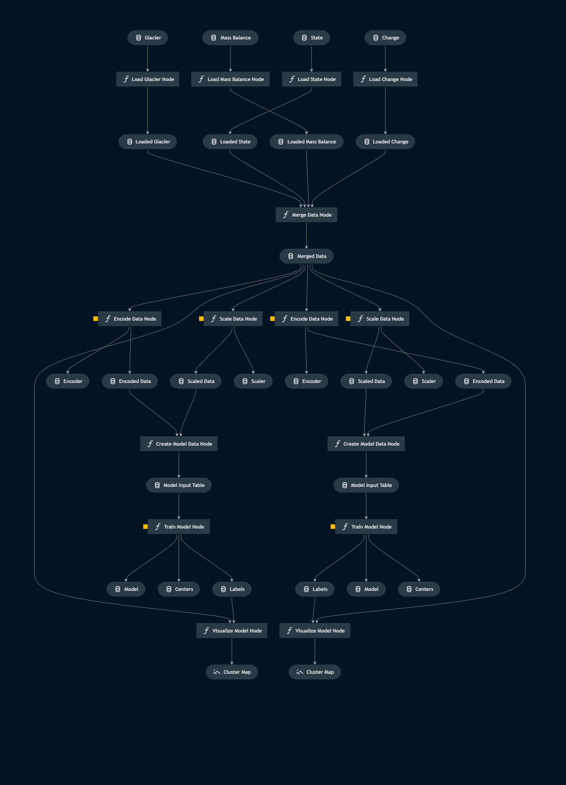
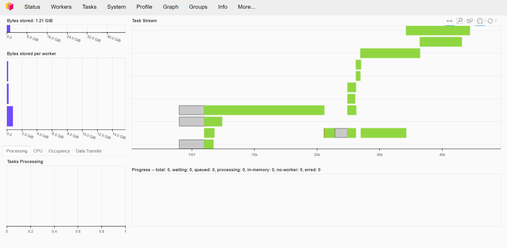
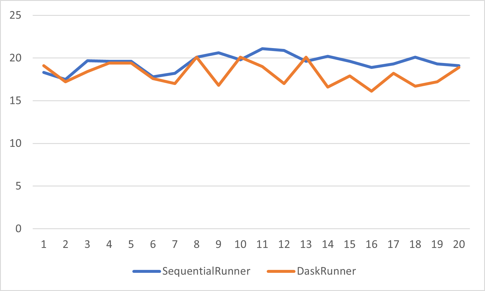

# Processing relational data using Kedro and Dask

A few months ago I came across this interessting framework [kedro](https://kedro.org/). According to its documentation,

> Kedro is an open-source Python framework to create reproducible, maintainable, and modular data science code. It uses software engineering best practices to help you build production-ready data science pipelines.

This sounds very promising at first so I wanted to give it a try since then. To facilitate production ready pipelines, kedro provides many useful integrations for other frameworks and different purposes. One of these integrations is Dask. Dask is a framework for parallel and distributed computing in Python. It is very useful for processing large amounts of data. In this post I will show how to use kedro and dask to process relational data.

You will learn:
* The key concepts of kedro
* How to install and use kedro to create a pipeline
* How to use dask to process data in parallel

In this tutorial, we will build a clustering pipeline for glaciers. The data is provided by the world glacier monitoring service and is available on (their website)[https://wgms.ch/data_databaseversions/]. The data is stored in as relational database. We will use the data to cluster glaciers into groups based on their location and elevation as well as their changes in size over the last years. The clustering will be done using the KMeans algorithm.

## Introduction to kedro
Before we start coding, I want to give a short introduction into the key concepts of kedro. Initially developed by some folks at McKinsey, a well known consultancy firm, kedros inner functioning is built upon three main concepts: nodes, pipelines and the data catalog. These concepts are explained in detail in the documentation but I will give a short overview here.
### Nodes
Nodes are the building blocks of any pipeline. They are pure python functions with predefined in- and outputs. Any node can use the output of any other node as input.
### Pipelines
Pipelines are a collection of nodes. They are used to group nodes into logical units and define their order of execution. Pipelines can be nested. This means that a pipeline can contain other pipelines. This is useful if you want to reuse a pipeline in another pipeline.
### Data catalog
The data catalog is a central registry for all data used in the pipeline. It is used to define the inputs and outputs of nodes. The data catalog also provides a central place to define the location of the data. This is useful if you want to change the location of the data. You only have to change the location in the data catalog and not in every node that uses the data.

### Installing kedro
Installing kedro is very easy. You can install it using pip:
```bash
pip install kedro
```
After installing kedro, you can create a new project using the kedro cli:
```bash
kedro new
```
This will create a new project in the current directory. The project will contain a few files and folders. The most important ones are:	
* data: This folder contains all data in- and outputs as well as all models created within the pipeline. The subdirectories follow a flow structure. The data is stored in the raw subdirectory. The intermediate data is stored in the 01_intermediate subdirectory. The final data is stored in the 02_primary subdirectory. The models are stored in the models subdirectory. 
* conf: This folder contains the project configuration and the data catalog. The data catalog is a yaml file that defines the inputs and outputs of the nodes. The data sets are python classes that define how to load and save the data.
* src: This folder contains all nodes and pipelines. The nodes are python files that contain the actual code. The pipelines are python files that define the order of execution of the nodes.

## Preparation
Before we can start setting up our pipeline, we will add all our datafiles to the *data/01_raw/* folder. We will also register our files in the data catalog. This is done by adding the following lines to the *conf/base/catalog.yml* file.
```yaml	
glaciers:
  type: pandas.CSVDataSet
  filepath: data/01_raw/glacier.csv

mass_balance:
  type: pandas.CSVDataSet
  filepath: data/01_raw/mass_balance.csv

change:
  type: pandas.CSVDataSet
  filepath: data/01_raw/change.csv

state:
  type: pandas.CSVDataSet
  filepath: data/01_raw/state.csv
```
This will add a dataset for the most important data files. The data catalog also supports other file formats like parquet, excel, json, etc. For more information on the data catalog, see the documentation. The following datasets are now available in the data catalog:
* glaciers: The glaciers dataset contains information about the glaciers.
* mass_balance: Glacier mass balance measurements by elevation band.
* change: Change in glacier thickness, area, and/or volume – typically from geodetic surveys.
* state: Glacier length, area, and elevation range.

## Creating a first pipeline
Now that we have our data, we can start creating our first pipeline. We will start by creating a pipeline that loads the data and merges it into one dataset. To create a new pipeline, we will run the following command:
```bash
kedro pipeline create merge_data
```

This command generates all the files you need for the pipeline:
* Two python files within src/kedro_tutorial/pipelines/data_processing
    * nodes.py (for the node functions that form the data processing)
    * pipeline.py (to build the pipeline)
* A yaml file: conf/base/parameters/data_processing.yml to define the parameters used when running the pipeline
* A folder for test code: src/tests/pipelines/data_processing
* __init__.py files in the required folders to ensure that Python can import the pipeline

Now will will do some coding and add our first nodes. For detailed reference, please refer to the repository linked below. The first node we will add is the load_glaciers node. This node will load the glaciers dataset from the data catalog and return it. The code for this node is as follows:
```python
def load_glaciers(glaciers: pd.DataFrame) -> pd.DataFrame:
    """Load glaciers to remove duplicates and glaciers without position."""

    glaciers = glaciers.drop_duplicates(subset=["WGMS_ID"])
    glaciers = glaciers.dropna(subset=["WGMS_ID", "LAT", "LON"])
    glaciers = glaciers[["PRIM_CLASSIFIC", "FORM", "FRONTAL_CHARS"]].fillna(99)
    glaciers = glaciers[["WGMS_ID", "LATITUDE", "LONGITUDE", "PRIM_CLASSIFIC", "FORM", "FRONTAL_CHARS"]]
    return glaciers
```

After adding all nodes, we can add them to the pipeline. The pipeline is defined in the *src/kedro_tutorial/pipelines/data_processing/pipeline.py* file. The pipeline is defined as follows:
```python
def create_pipeline(**kwargs) -> Pipeline:
    return pipeline([
        node(
            func=load_glaciers,
            inputs="glaciers",
            outputs="loaded_glaciers",
            name="load_glacier_node",
        ),
    ])
```

To access data later on we can add the outputs to our data catalogue. To do this, we will add the following lines to the *conf/base/catalog.yml* file:
```yaml
loaded_glacier:
  type: pandas.ParquetDataSet
  filepath: data/02_intermediate/loaded_glacier.pq

loaded_mass_balance:
  type: pandas.ParquetDataSet
  filepath: data/02_intermediate/loaded_mass_balance.pq

loaded_change:
  type: pandas.ParquetDataSet
  filepath: data/02_intermediate/loaded_change.pq

loaded_state:
  type: pandas.ParquetDataSet
  filepath: data/02_intermediate/loaded_state.pq
```

We can then run the pipeline using the following command:
```bash
kedro run
```	

We see our data being processed and saved to the intermediate folder. We can now use this data in our next pipeline or other nodes. We will now create another node that merges the data and save its output to the primary folder. After that it is time to take a step back and look at what we have done so far:

* Created a new project and installed dependencies
* Added four datasets to the project and set up the Kedro Data Catalog
* Created a data processing pipeline with five nodes to transform and merge the input datasets and create a model input table

## Creating a second pipeline for modelling
Now that we have our data, we can start creating our second pipeline. We will start by creating a pipeline that can cluster our table input. To create a new pipeline, we will run the following command:
```bash
kedro pipeline create data_science
```

This command again generates all the files you need for the pipeline. We will now only add our data science code as nodes. We will have nodes for the following steps:
* scaling
* encoding
* training
* visualizing

## The final pipeline
The following sections will show the final pipeline. The code for the nodes can be found in the repository linked below. The final pipeline is defined as follows:


The visualization is created using kedro viz - a visualisation tool for Kedro pipelines.
The visualization shows each node and their inputs and outputs as well as their relationships. For modelling, two pipelines are created. One pipeline to build the current model. The second pipeline is used to create a new version of the model (the candidate model). The candidate model is then compared to the current model. If the candidate model is better, it is deployed. If not, the current model is kept. In order to compare the models, both will output a model visualisation. In a further step, two metrics are defined and compared. The aim of the two modelling paths is to create a situation where paralellization is possible/useful.

## Dask and Kedro
Dask is a library for parallel computing in Python. It can be used to scale up your data science code. Kedro is a framework for data engineering and data science. It can be used to create reproducible pipelines. The two libraries can be combined to create a scalable data science pipeline. The following sections will show how to use Dask with Kedro.

In order to manage and execute pipelines and their nodes, Kedro uses a runner. The runner is responsible for executing the pipeline. The default runner is SequentialRunner. This runner executes the pipeline sequentially. In order to use Dask, we will use the DaskRunner. To initiate a DaskRunner, we will add a new module in our package. The new *runner* module will contain a *__init__.py* file and a *dask_runner.py* file. The magic happens in the DaskRunner file. The DaskRunner inherits from the *AbstractRunner* class and creates a Dask client. The Dask client is used to execute the nodes in parallel. The DaskRunner initializes the Dask client with the default parameters:
```python
def __init__(self, client_kwargs=None):
    self.client_kwargs = client_kwargs or {}
    self.client = Client(**self.client_kwargs)
```

The DaskRunner also has a run method that executes the pipeline. The run method is called by the Kedro CLI. The run method includes a loop over nodes using the current Dask client. The Dask client is used to submit the nodes to the Dask scheduler. The Dask scheduler then distributes the nodes to the Dask workers. The Dask workers then execute the nodes in parallel.
```python
client = Client.current()
for node in nodes:
    dependencies = (
        node_futures[dependency] for dependency in node_dependencies[node]
    )
    node_futures[node] = client.submit(
        DaskRunner._run_node,
        node,
        catalog,
        self._is_async,
        session_id,
        *dependencies,
    )
```

Next, we will add the DaskRunner to our project. Therefore, we have to add a new implementation of the *kedro run* command. We will add a new *cli.py* file in our package. The *cli.py* file will add a new run command. The command is simply a copy of the original run command with the DaskRunner instead of the SequentialRunner. The new runner is called as follows:
```python
def _instantiate_runner(runner, is_async, project_context):
    runner_class = load_obj(runner, "kedro.runner")
    runner_kwargs = dict(is_async=is_async)

    if runner.endswith("DaskRunner"):
        client_args = project_context.params.get("dask_client") or {}
        runner_kwargs.update(client_args=client_args)

    return runner_class(**runner_kwargs)
```

Last but not least we will tell Kedro where to find our Dask runner. Therefore, we will add a *config/dask/parameters.yml* file. The file will contain the following parameters:
```yaml
dask_client:
  address: 127.0.0.1:8786
```

Note: Also add a *credentials.yml* file to the config folder. Kedro requires a credentials file to run. The file can be empty.

## Running the pipeline with Dask
Before we can run the pipeline with Dask, we have to start a Dask Cluster. The cluster can be started using the following command:
```bash
dask scheduler 
```
Next, we will start a Dask Worker. The worker can be started using the following command in a new terminal:
```bash
dask worker 127.0.0.1:8786
```

After starting three nodes, we can now run the pipeline using the following command:
```bash
kedro run --env dask --runner glacier_clustering.runner.DaskRunner
```
This will run the pipeline on our Das Cluster. The Dask Cluster can be accessed via the dashboard. The dashboard can be accessed via the following link: http://127.0.0.1:8787/status. The dashboard shows the Dask Cluster and the progress of the pipeline. The following image shows the dashboard after running the pipeline:


## Conclusion
As we can see from the screenshot above, there are three workers waiting for tasks. After running the command, we can observe all workers executing tasks. Some tasks are indeed executed in paralell. One remaining question to be answered is if the Dask Cluster is faster than the SequentialRunner. The following sections will show the results of the experiment using a time function to measure the time used by a command line command.
For 20 runs, the DaskRunner outperformed the SequentialRunner. The average time for the DaskRunner was 18.1 seconds. The average time for the SequentialRunner was 19.5 minutes. The DaskRunner was therefore about 10% faster than the SequentialRunner. Executing the pipeline in parallel is therefore a good idea. The following image shows the results of the experiment:



## References
[1] [Code](https://github.com/fabiankay/glacier_clustering) - The code can be found on my GitHub page.

[2] [Dask](https://dask.org/) - Dask is a flexible library for parallel computing in Python.

[3] [Kedro](https://kedro.readthedocs.io/en/stable/) - Kedro is a framework for data engineering and data science.

[4] [Kedro Viz](https://kedro-viz.readthedocs.io/en/stable/) - Kedro Viz is a tool for visualizing Kedro pipelines.

[5] [Data] WGMS (2022): Fluctuations of Glaciers Database. World Glacier Monitoring Service (WGMS), Zurich, Switzerland. https://doi.org/10.5904/wgms-fog-2022-09
